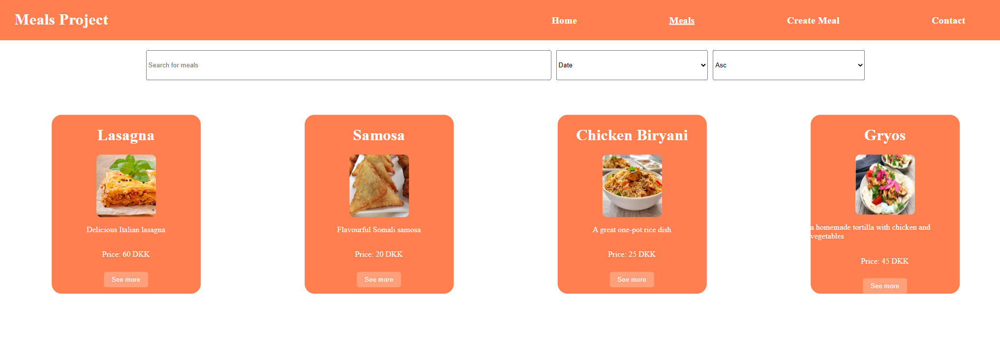

# 🍽️ Meal Sharing

This is a full-stack Meal Sharing website.  
It allows users to browse available meals, create meals, make reservations, and leave reviews.

It includes the following sections:
- **Meals**: View all available meals with details such as title, description, price, and location.
- **Create Meal**: Create new meals using a form.
- **Reservations**: Reserve a meal by submitting a reservation form.
- **Reviews**: Leave reviews for meals.
 
---

## 📷 Preview



---

## 🚀 Live Demo

Check out the live version of the Meal Sharing project  
[live demo](https://meal-sharing-amber.vercel.app/)

---

## 🏁 Getting Started

### 1. Clone the repository, and change to it:
```bash
git clone https://github.com/your-username/meal-sharing.git
cd meal-sharing/app-next
```

### 2. Install dependencies:
```bash
npm install
```

### 3. Run development server:
```bash
npm run dev
```
(The backend API and database are hosted on Railway, so no local database setup is required.)

---

## 🛠 Built with

- **Next.js** (Frontend)
- **Node.js & Express** (Backend)
- **MySQL** (Database)
- **CSS** (Styling)
- **Vercel** (Frontend deployment)
- **Railway** (Backend & Database deployment)


